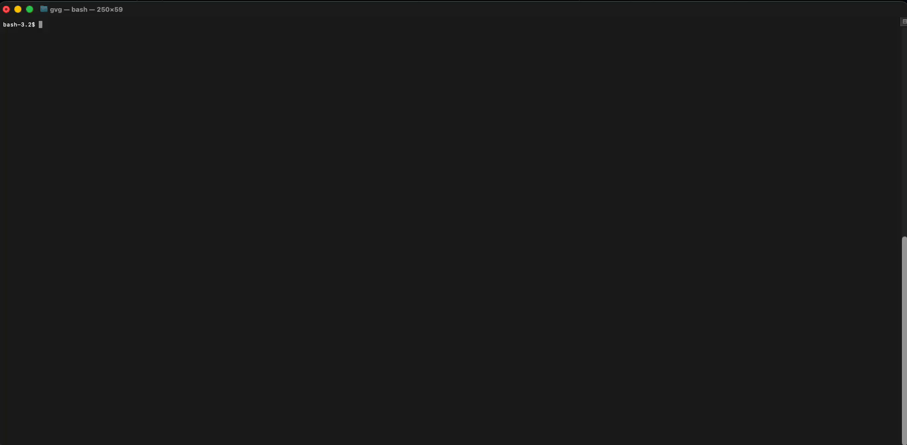

# Kubesec

[![Testing Workflow][testing_workflow_badge]][testing_workflow_badge]
[![Security Analysis Workflow][security_workflow_badge]][security_workflow_badge]
[![Release Workflow][release_workflow_badge]][release_workflow_badge]

[![Go Report Card][goreportcard_badge]][goreportcard]
[![PkgGoDev][go_dev_badge]][go_dev]

<!-- markdownlint-disable no-inline-html header-increment -->
<!-- markdownlint-disable line-length -->

#### <center>🚨 v1 API is deprecated, please read the <a href="https://github.com/controlplaneio/kubesec/blob/master/README.md#release-notes" target="_blank">release notes</a> 🚨</center>

<!-- markdownlint-enable line-length -->

### Security risk analysis for Kubernetes resources

<p align="center">
  
</p>

## 🎬 Demo



For more examples visit [Kubesec.io](https://kubesec.io), which uses ControlPlane's hosted API at [v2.kubesec.io/scan](https://v2.kubesec.io/scan).

---

- [Quick Start](#-quick-start)
- [Download Kubesec](#-download-kubesec)
- [Usage Examples](#-usage-examples)
  - [Scanning](#scanning)
    - [Docker Usage](#docker-usage)
    - [Output Formats](#output-formats)
  - [Print Rules](#print-rules)
  - [Custom Schemas](#custom-schemas)
- [HTTP Server Mode](#http-server-mode)
- [Kubesec-as-a-Service](#kubesec-as-a-service)
- [Contributing](/CONTRIBUTING.md)
- [Getting Help](#getting-help)
- [Changelog](/CHANGELOG.md)

## 🚀 Quick Start

### 1. Prepare Your Manifest

Create a Kubernetes resource file (e.g., `kubesec-test.yaml`) to scan. For a quick test, you can save the following Pod
manifest:

```bash
$ cat <<EOF > kubesec-test.yaml
apiVersion: v1
kind: Pod
metadata:
  name: kubesec-demo
spec:
  containers:
  - name: kubesec-demo
    image: gcr.io/google-samples/node-hello:1.0
    securityContext:
      readOnlyRootFilesystem: true
EOF
```

### 2. Run Your First Scan

Execute a scan against your manifest file:

```shell
# Using the local binary
kubesec scan kubesec-test.yaml

# Or using Docker
docker run -i kubesec/kubesec:v2 scan /dev/stdin < kubesec-test.yaml

# Using the local binary with a human-readable table output format
kubesec scan kubesec-test.yaml --format table
```

> [!TIP]
> To view the results in a human-readable table instead of the default JSON format, use the `--format table` flag

`kubesec` will output a security score and a detailed analysis of your resource.

## 📦 Download Kubesec

Kubesec is available as a:

- [Docker container image](https://hub.docker.com/r/kubesec/kubesec/tags) at `docker.io/kubesec/kubesec:v2`
- Linux/MacOS/Win binary (get the [latest release](https://github.com/controlplaneio/kubesec/releases))
- [Kubernetes Admission Controller](https://github.com/controlplaneio/kubesec-webhook)
- [Kubectl plugin](https://github.com/controlplaneio/kubectl-kubesec)

Or install the latest commit from GitHub with:

### Go 1.16+

```bash
$ go install github.com/controlplaneio/kubesec/v2@latest
```

### Go version < 1.16

```bash
$ GO111MODULE="on" go get github.com/controlplaneio/kubesec/v2
```

## 📖 Usage Examples

### Scanning

Scan Kubernetes resources from local files or standard input.

Kubesec can scan multiple YAML documents in a single input file, or scan documents from multiple files at once, as long
as they are correctly formatted as multiple documents separated by `---`.

```bash
# Scan a specific local YAML file
kubesec scan ./deployment.yaml

# Scan from standard input (JSON or YAML)
cat file.json | kubesec scan -

# Scan a rendered Helm chart
helm template -f values.yaml ./chart | kubesec scan /dev/stdin

# Scan multiple YAML documents separated by '---'
{ cat test/asset/multi.yml; echo "---"; cat test/asset/critical.yml; } | kubesec scan -
```

#### Docker Usage

You can run the same scanning commands using the official Docker image:

```bash
# Scan a file via Docker using standard input
docker run -i kubesec/kubesec:v2 scan /dev/stdin < kubesec-test.yaml
```

#### Output Formats

Kubesec supports three different output formats, specified by the `--format` / `-f` flag: `json` (default),
`table`, and `template`, and can scan multiple YAML documents in a single input file.

```bash
# JSON array output (default behaviour)
kubesec scan ./deployment.yaml --format json

# Human-readable table output
kubesec scan ./deployment.yaml --format table

# Use a custom template for the output
kubesec scan ./deployment.yaml --format template --template report-template.tmpl
```

##### Example JSON Output

```json
[
  {
    "object": "Pod/security-context-demo.default",
    "valid": true,
    "message": "Failed with a score of -30 points",
    "score": -30,
    "scoring": {
      "critical": [
        {
          "selector": "containers[] .securityContext .capabilities .add == SYS_ADMIN",
          "reason": "CAP_SYS_ADMIN is the most privileged capability and should always be avoided",
          "points": -30
        }
      ],
      "advise": [
        {
          "selector": "containers[] .securityContext .runAsNonRoot == true",
          "reason": "Force the running image to run as a non-root user to ensure least privilege",
          "points": 1
        },
        {
          // ...
        }
      ]
    }
  }
]
```

##### Example Table Output


### Print Rules

```bash
# Print all scanning rules with their associated point scores
kubesec print-rules

# Print all scanning rules with their associated point scores as a table
kubesec print-rules --format table
```

#### Example Rules Output JSON

```json
[
  {
    "id": "AllowPrivilegeEscalation",
    "selector": "containers[] .securityContext .allowPrivilegeEscalation == true",
    "reason": "Ensure a non-root process can not gain more privileges",
    "kinds": [
      "Pod",
      "Deployment",
      "StatefulSet",
      "DaemonSet"
    ],
    "points": -7,
    "advise": 0
  },
...
]
```

### Custom Schemas

Kubesec leverages kubeconform (thanks @yannh) to validate the manifests to scan.
This implies that specifying different schema locations follows the rules as
described in [the kubeconform README](https://github.com/yannh/kubeconform#overriding-schemas-location).

```bash
# Usees the latest schema from upstream
# Schema will be fetched from: https://raw.githubusercontent.com/yannh/kubernetes-json-schema/master/master-standalone-strict/pod-v1.json
kubesec scan ./pod.yaml

# Use a specific schema version from upstream (format x.y.z with no v prefix)
# Schema will be fetched from: https://raw.githubusercontent.com/yannh/kubernetes-json-schema/master/v1.25.3-standalone-strict/pod-v1.json
kubesec scan ./pod.yaml --kubernetes-version 1.25.3

# Use a specific schema version in an airgapped environment over HTTP
# Schema will be fetched from: `https://host.server/v<version>-standalone-strict/pod-v1.json`
kubesec scan ./deployment.yaml --kubernetes-version <version> --schema-location https://host.server

# Use a specific schema version in an airgap environment with local files
# Schema will be read from: `/opt/schemas/v<version>-standalone-strict/pod-v1.json`
kubesec scan ./deployment.yaml --kubernetes-version <version> --schema-location /opt/schemas
```

**Note:** in order to limit external network calls and allow usage in airgap
environments, the `kubesec` image embeds schemas. If you are looking to change
the schema location, you'll need to change the `K8S_SCHEMA_VER` and `SCHEMA_LOCATION`
environment variables at runtime.

## HTTP Server Mode

Kubesec includes a bundled HTTP server that you can run locally or in a container to accept scan requests over the network.

### CLI Usage

```bash
# Start the HTTP server in the background on port 8080
kubesec http 8080 &

# Send a file to the running server via POST
curl -sSX POST --data-binary @deployment.yaml http://localhost:8080/scan

# Stop the background local server when finished
kill %
```

### Docker Usage

```bash
# Start the HTTP server using Docker
docker run -d -p 8080:8080 kubesec/kubesec:v2 http 8080

# Send a file to the running server via POST
curl -sSX POST --data-binary @deployment.yaml http://localhost:8080/scan
```

Don't forget to stop the server.

## Kubesec-as-a-Service

Kubesec is also available via HTTPS at [v2.kubesec.io/scan](https://v2.kubesec.io/scan).

**Do not submit sensitive YAML to this public service.**

The service is ran on a good faith best effort basis.

```bash
# Submit a manifest directly to the hosted v2 API
curl -sSX POST --data-binary @"deployment.yaml" https://v2.kubesec.io/scan

# Parse the API output using jq to return a non-zero exit code if the score is <= 10
curl -sSX POST --data-binary @"deployment.yaml" https://v2.kubesec.io/scan | jq --exit-status '.score > 10'
```

You may also define a Bash function, e.g.:

```bash
# Define a BASH function
$ kubesec ()
{
    local FILE="${1:-}";
    [[ ! -e "${FILE}" ]] && {
        echo "kubesec: ${FILE}: No such file" >&2;
        return 1
    };
    curl --silent \
      --compressed \
      --connect-timeout 5 \
      -sSX POST \
      --data-binary=@"${FILE}" \
      https://v2.kubesec.io/scan
}


# POST a Kubernetes resource to v2.kubesec.io/scan
$ kubesec ./deployment.yml

# Return non-zero status code is the score is not greater than 10
$ kubesec ./score-9-deployment.yml | jq --exit-status '.score > 10' >/dev/null
# status code 1
```

---

## Contributing

Check out [CONTRIBUTING.md](CONTRIBUTING.md) for more information.

## Getting Help

If you have any questions about Kubesec and Kubernetes security:

- Read the Kubesec docs
- Reach out on Twitter to [@sublimino](https://twitter.com/sublimino) or [@controlplaneio](https://twitter.com/controlplaneio)
- File an issue

Your feedback is always welcome!

[testing_workflow]: https://github.com/controlplaneio/kubesec/actions?query=workflow%3ATesting
[testing_workflow_badge]: https://github.com/controlplaneio/kubesec/actions/workflows/test_acceptance.yml/badge.svg
[security_workflow]: https://github.com/controlplaneio/kubesec/actions?query=workflow%3A%22Security+Analysis%22
[security_workflow_badge]: https://github.com/controlplaneio/kubesec/workflows/Security%20Analysis/badge.svg
[release_workflow]: https://github.com/controlplaneio/kubesec/actions?query=workflow%3ARelease
[release_workflow_badge]: https://github.com/controlplaneio/kubesec/workflows/Release/badge.svg
[goreportcard]: https://goreportcard.com/report/github.com/controlplaneio/kubesec
[goreportcard_badge]: https://goreportcard.com/badge/github.com/controlplaneio/kubesec
[go_dev]: https://pkg.go.dev/github.com/controlplaneio/kubesec/v2
[go_dev_badge]: https://pkg.go.dev/badge/github.com/controlplaneio/kubesec/v2

---

Made with ❤ by [ControlPlane](https://control-plane.io/)